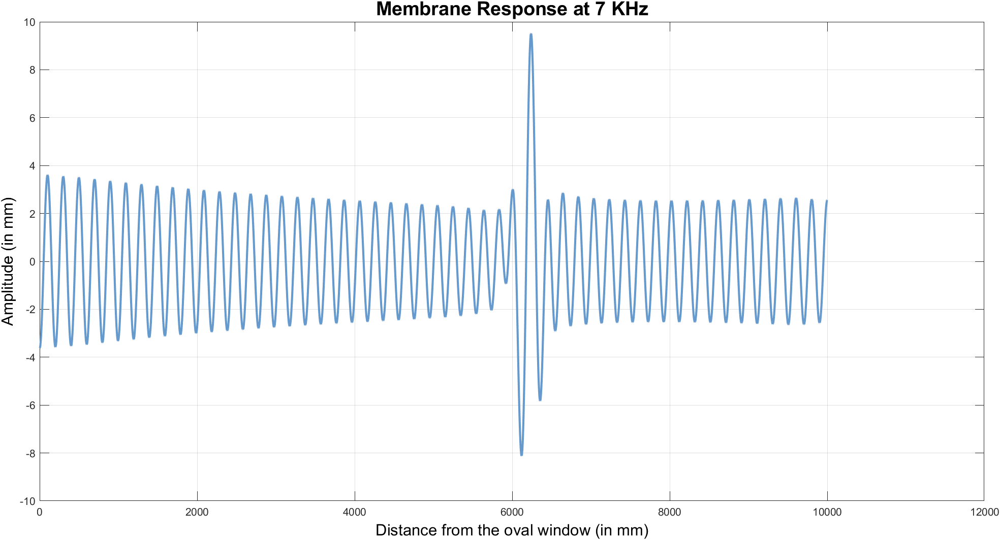

# Mathematical Modeling of the Hearing Process

## Abstract

Hearing as a perception process consists of several stages, starting off from the outer ear going over the middle ear and ending up at the inner ear. The hearing process is like a hand over process, where each part of the ear hands over the detected sound wave to the proceeding part after processing it somehow. At the end of such process the sound is transformed form the mechanical form to the electrical form which the brain can deal with, in what is known as the transduction of sound, which is considered the most central event of the hearing process. The biological device which is responsible for such transduction is the cochlea, which contains a frequency analyzer in the form of membrane called the Basilar membrane.\
\
 The task of the Basilar membrane is to identify the constituent frequencies of sound, and thus identify the sound. Such process is done by means of mechanical resonance, where each section on the membrane selectively resonates with specific frequency, and therefore gets a maximum amount of kinetic energy in the form of oscillation, this oscillation is then translated into a shear force due to frictions, which in turn causes a change in the membrane potential. This potential difference is carried and transmitted through the auditory nerves directly to the brain where the interpretation is performed for different frequencies 


## Model Description

Despite of all two-dimensional 
models that have been developed, we have chosen Lesser and Berkley model.  This model is one of the best models for the 
macro-mechanical response of the 
cochlea that has been developed by 
Lesser and Berkley, where each point of 
the basilar membrane is modelled as a 
simple damped harmonic oscillator with 
mass, damping, and stiffness that vary 
along the length of the membrane.


## Analysis Methods

### Analytical Solution

The analytical solution explores the mechanical behavior of the Basilar membrane using Neely parameters, including mass, damping, and stiffness. The simulation calculates the displacement of each point on the membrane in response to a given input frequency. The results are visualized to understand the membrane's behavior over distance.

#### Usage

1. set the input frequency tone of examination.
2. Run the script to obtain the displacement profile.

#### Sample Output

<div style="text-align: center;">
  
</div>


### Resonance Analysis

The resonance analysis explores the resonance behavior of specific point on the membrane by calculating the amplitude of displacement in response to a single input tone across a range of frequencies. This analysis helps identify resonant frequencies and understand the system's behavior under different frequency inputs.

#### Usage

1. Set the distance point of examination and range of frequency of concern.
2. Run the script to obtain the amplitude of displacement over a range of frequencies.

#### Sample Output (multiple outputs together)

<div style="text-align: center;">

</div>

### Power Analysis

The power analysis investigates the average power dissipated in the system. Utilizing Neely parameters and a single input tone, the script calculates the average power across a range of frequencies. The resulting power curve provides valuable information about the system's energy dissipation characteristics.

#### Usage

1. Set the distance point of examination and range of frequency of concern.
2. Run the script to obtain the amplitude of displacement over a range of frequencies.

#### Sample Output (multiple outputs together)
<div style="text-align: center;">

</div>

## Installation

1. Clone the repository:

    ```bash
    git clone https://github.com/hearing-model.git
    cd Cochlea_Source_Code
    ```

2. Ensure MATLAB is installed with necessary toolboxes for symbolic computations.

3. Execute the scripts:

    ```matlab
    run analytical_solution.m
    run power_analysis.m
    run resonance_analysis.m
    ```

4. Explore and modify parameters as needed for specific analyses.

